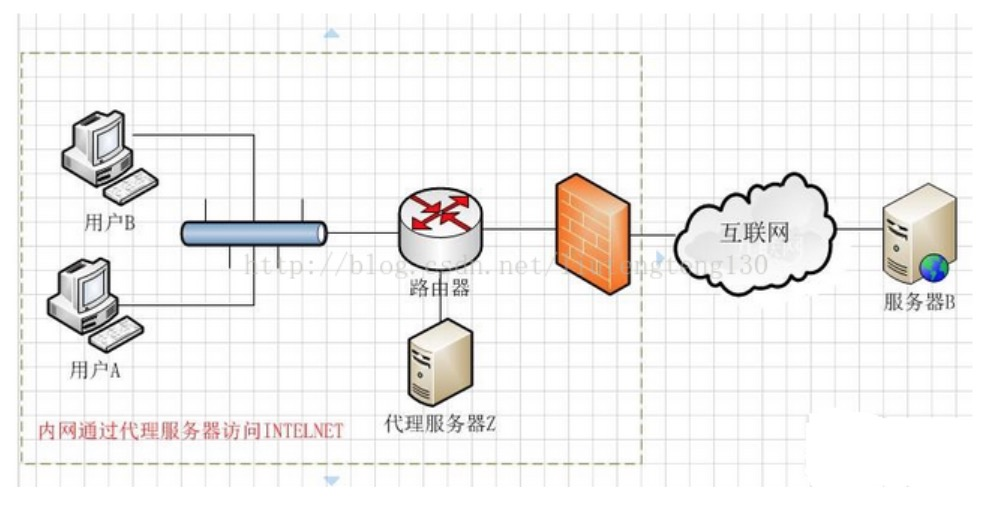
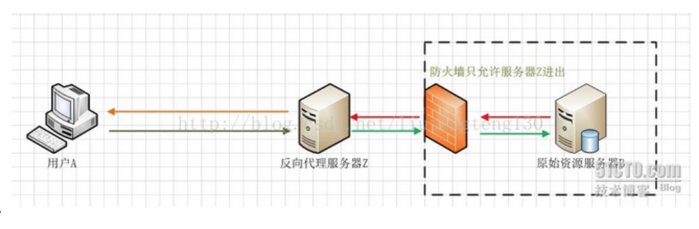
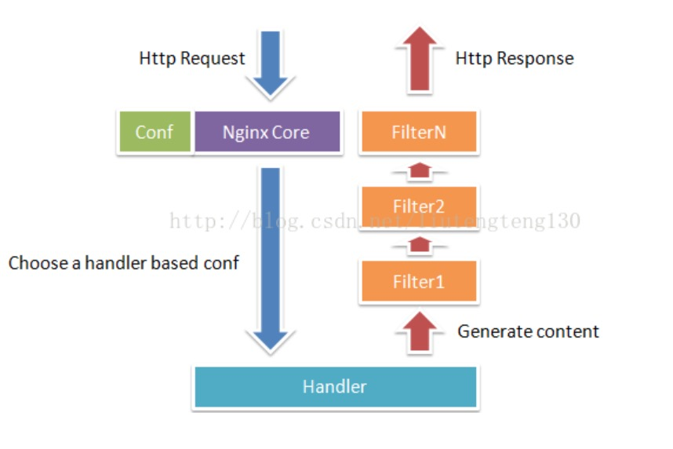
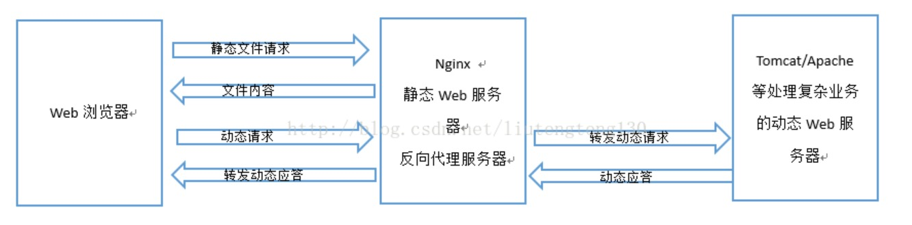

# Nginx

#### 什么是Nginx?
 
1、Nginx是一个**高性能的HTTP和反向代理服务器**，也是一个IMAP/POP3/SMTP代理服务器。   
2、Nginx是一款**轻量级**的Web服务器/反向代理服务器以及电子邮件代理服务器，并在一个BSD-like协议下发行。由俄罗斯的程序设计师lgor Sysoev所开发，供俄国大型的入口网站及搜索引擎Rambler使用。其特点是占有内存少，并发能力强，事实上nginx的并发能力确实在同类型的网页服务器中表现较好。

#####  代理服务器

一般是指局域网内部的机器通过代理服务器发送请求到互联网上的服务器，代理服务器一般**作用在客户端**。

#####  正向代理

正向代理是一个位于客户端A和原始服务器（服务器B）之间的服务器（代理服务器Z），为了从原始服务器取得内容，用户A向代理服务器Z发送一个请求并指定目标（服务器B），然后代理服务器Z向服务器B转交请求并将获得的内容返回给客户端。客户端必须要进行一些特别的设置才能使用正向代理。

#####  反向代理

客户端（用户A）向反向代理的命名空间（name-space）中的内容发送普通请求，接着反向代理将判断向何处（原始服务器）转交请求，并将获得的内容返回给客户端。而客户端始终任务它访问的事原始服务器B而不是服务器Z。由于防火墙作用，只允许服务器Z进出，防火墙和反向代理共同作用**保护了原始资源服务器B**。

#### Nginx的优势

1、作为Web服务器，Nginx处理静态文件、索引文件，自动索引的效率非常高   
2、作为代理服务器，Nginx可以实现无缓存的反向代理加速，提高网站运行速度   
3、在性能方面，Nginx是专门为性能优化而开发的，实现上非常注重效率。可以支持更多的并发连接，而且只占用很低的内存资源   
4、在稳定性方面，Nginx采取了分阶段资源分配技术，使得CPU与内存的占用率非常低。   
5、在高可用性方面，Nginx支持热部署，启动速度特别迅速。可以在不间断服务的情况下，对软件版本或者配置进行升级，几乎可以做到7x24小时不间断地运行。   

#### Nginx的工作原理

Nginx会按需同时运行多个进程：一个主进程和几个工作进程，配置了缓存时还会有缓存加载器进程（cache loader）和缓存管理器进程（cache manager)等。所有进程均是仅含有一个线程，并主要通过“共享内存”的机制实现进程间通信。主进程以root用户身份运行，而worker、cache loader和cache manager均应以非特权用户身份运行。

#### 常规的HTTP请求和响应的过程

当它接收到一个HTTP请求时，它仅仅是通过查找配置文件将此次请求映射到一个location block,而此location中配置的各个指令则会启动不同的模块去完成工作，因此模块可以看做Nginx真正的劳动工作者。通常一个location中的指令会涉及一个handler模块和多个filter模块（当然，多个location可以服用同一个模块）。handler模块负责处理请求，完成响应内容的生成，而filter模块对响应内容进行处理。

#### Nginx作为HTTP服务器以及反向代理服务器

由于Nginx具有“强悍”的**高并发高负载能力**，因此一般会作为前端的服务器直接向客户端**提供静态文件服务**。但也有一些复杂、多变的业务不适合放到Nginx服务器上，这时会用Apache、Tomcat等服务器来处理。于是，Nginx通常会被配置为既是静态Web服务器也是反向代理服务器，不适合Nginx处理的请求就会直接转发到上游服务器中处理。

