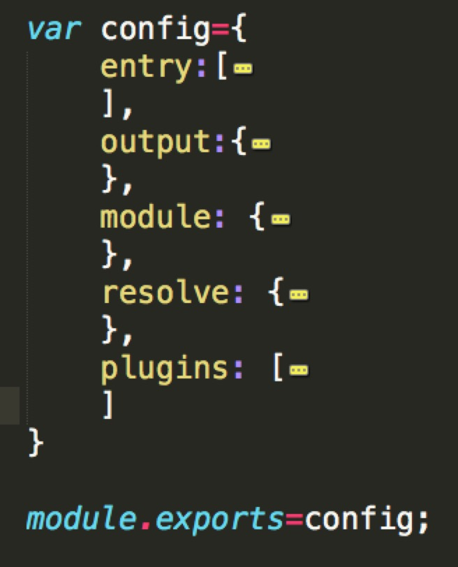

## webpack 基础    

### 安装webpack     
 
 作为全局安装 

```
$ npm install webpack -g
$ webpack -v    
```
作为项目依赖安装 

```
$ npm install --save webpack      
```
### webpack简介（配置项有如下几点）



```
* entry: 入口，定义要打包的文件。（即app第一个启动文件）  

* output: 出口，定义打包输出的文件，包括路径（path），文件名（filename），还可能有运行时的访问路径（publicPath）参数。   

* module: webpack将所有的资源都看做是模块，而模块就需要加载器；主要定义一些loaders,定义哪些后缀名的文件应该用哪些loader。

* resolve: 定义能够被打包的文件，文件后缀名 

* plugins: 定义一些额外的插件     

``` 


